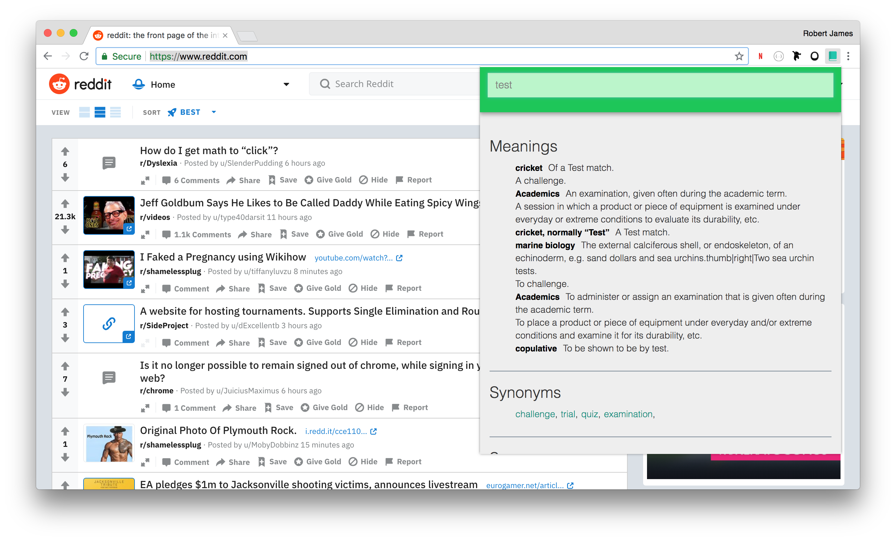
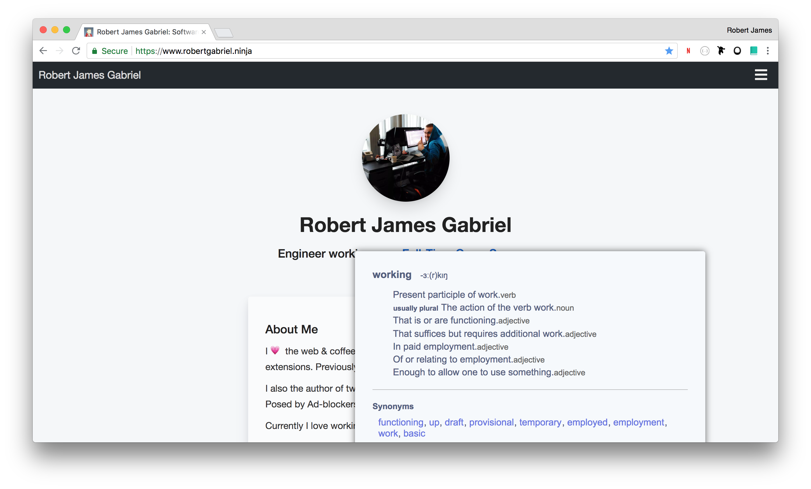

# Dictionary App
> Look up any word using wikipedia and Google Dictionary







## Getting Started

```sh

# Transform updated source written by ES2015 (default option)
gulp babel

# or Using watch to update source continuously
gulp watch

# Make a production version extension
gulp build
```

## Test Chrome Extension

To test, go to: chrome://extensions, enable Developer mode and load app as an unpacked extension.

Need more information about Chrome Extension? Please visit [Google Chrome Extension Development](http://developer.chrome.com/extensions/devguide.html)

## gulp tasks

### Babel

The generator supports ES 2015 syntax through babel transforming. You may have a source files in `script.babel` if your project has been generated without `--no-babel` options. While developing, When those of source has been changed, `gulp babel` should be run before test and run a extension on Chrome.

```sh
gulp babel
```

If you would like to have a continuous transforming by babel you can use `watch` task

### Watch

Watch task helps you reduce your efforts during development extensions. If the task detects your changes of source files, re-compile your sources automatically or Livereload([chromereload.js](https://github.com/yeoman/generator-chrome-extension/blob/master/app/templates/scripts/chromereload.js)) reloads your extension. If you would like to know more about Live-reload and preview of Yeoman? Please see [Getting started with Yeoman and generator-webapp](http://youtu.be/zBt2g9ekiug?t=3m51s) for your understanding.

```bash
gulp watch
```

You need to load/reload extension after starting `gulp watch` for Live-reload to work.

For content scripts you need to refresh pages where it is used.

### Build and Package

It will build your app as a result you can have a distribution version of the app in `dist`. Run this command to build your Chrome Extension app.

```bash
gulp build
```

You can also distribute your project with compressed file using the Chrome Developer Dashboard at Chrome Web Store. This command will compress your app built by `gulp build` command.

```bash
gulp package
```

## Options

* `--no-babel`

  If you wouldn't use [Babel](https://babeljs.io/) ES2015 transpiler.

* `--skip-install`

  Skips the automatic execution of `bower` and `npm` after
  scaffolding has finished.

* `--test-framework=[framework]`

  Defaults to `mocha`. Can be switched for
  another supported testing framework like `jasmine`.

* `--sass`

  Add support for [Sass](http://sass-lang.com/libsass).

* `--all-permissions`

  All of permissions of chrome extension will be shown.

### ES2015 and babel

ES2015 is the `default option` in the generator that means you can use es2015 now for developing the Chrome extensions. However, at this moment, you need to execute `babel` task of gulp to compile to test and run your extension on Chrome, because [ES2015 is not full functionality on Chrome as yet](http://kangax.github.io/compat-table/es6/).

The sources written by es2015 is located at `scripts.babel` and runnable sources will be at `script` after compiling by `gulp babel`. May you don't want to use babel and ES2015 use `--no-babel` option when scaffolding a new project.

```sh
yo chrome-extension --no-babel
```

### Sass

This generator supports `sass` through `--sass` options and generate `scss` boilerplate files at `styles.scss` that those of `scss` files will be compiled to `styles` via `gulp style` task. To do this, `libsass` is featured in the generator. Please see [this](https://github.com/yeoman/generator-gulp-webapp#libsass) for further information.

```sh
yo chrome-extension --sass
```

### All of Permissions for Chrome Extension

Need to add more permissions for chrome extension? You can get all list of permissions using `--all-permissions` option when scaffolding a new project.

```sh
yo chrome-extension --all-permissions
```
